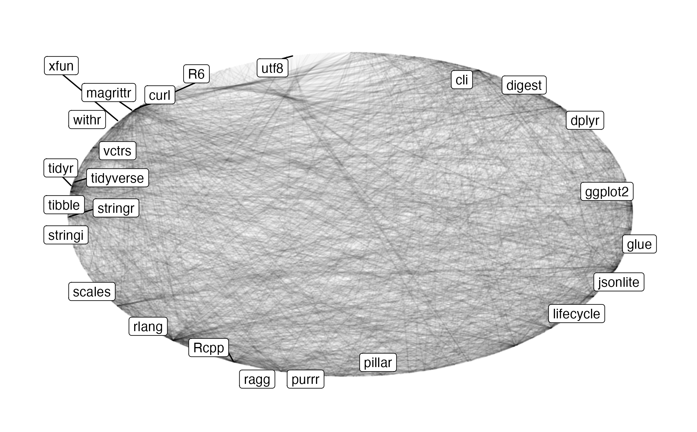

## Disclaimer




## Welcome to GSWEP4R at SAIHST!

\
\

_We have an open source spirit here. Please sit with someone you do not already know._


\
\


Be Curious. Be Respectful. Be Kind.

## Daniel

::: columns
::: {.column width="30%"}

:::

::: {.column width="70%"}
-   Ph.D. in Statistics from University of Zurich, Bayesian Model Selection
-   Biostatistician at Roche for 5 years, Data Scientist at Google for 2 years, Statistical Software Engineer at Roche for the last 4 years
-   Co-founder of [inferential.bio](https://inferential.bio) and [RCONIS](https://rconis.com)
-   Multiple R packages on CRAN and Bioconductor, co-wrote book on Likelihood and Bayesian Inference, chair of `openstatsware`
-   Feel free to connect
    [`r fontawesome::fa("linkedin")`](https://www.linkedin.com/in/danielsabanesbove/)
    [`r fontawesome::fa("github")`](https://github.com/danielinteractive)
    [`r fontawesome::fa("globe")`](https://rconis.com)
:::
:::

## `openstatsware`

::: columns
::: {.column width="70%"}
- [openstatsware.org](https://openstatsware.org)
- Since: 19 August 2022 - already 3 years now!
- Where: American Statistical Association (ASA) Biopharmaceutical Section (BIOP), European Federation of Statisticians in the Pharmaceutical Industry (EFSPI)
- Who: Currently more than 60 statisticians from more than 30 organizations
- What: Engineer packages and promote best practices
:::

::: {.column width="30%"}
{height="300"}
:::
:::

## What you will learn here

-   Understand the basic structure of an R package
-   Create your own R `r fontawesome::fa("cube")`
-   Learn about & apply professional `r fontawesome::fa("cube")` development workflow
-   Learn & apply fundamentals of quality control for R `r fontawesome::fa("cube")`
-   Get crash-course in version control and modern collaboration techniques on GitHub.com
-   Learn how to make an R `r fontawesome::fa("cube")` available to others

## Program outline

```{r}
#| echo: false
#| style: font-size:0.8em!important;
readr::read_csv("resources/program.csv", col_types = "cc") |>
    knitr::kable(col.names = c("", ""))
```

## House-keeping

-   Course website at [openstatsware.github.io/shortcourse-seoul2026](https://openstatsware.github.io/shortcourse-seoul2026)
    -   all slides
    -   sources available at [github.com/openstatsware/shortcourse-seoul2026](https://github.com/openstatsware/shortcourse-seoul2026)
    -   all materials CC-BY-SA 4.0

## What you will need

-   [Github.com](https://github.com/) (free) account `r fontawesome::fa("github")`
-   Local R development environment with
    -   git `r fontawesome::fa("git-alt")`
    -   Rtools/R/Rstudio IDE `r fontawesome::fa("r-project")`
-   Install additional R packages using the [installation script](slides/download/install.R)
-   Curiosity `r emoji::emoji("curious")`
-   Positive attitude `r emoji::emoji("smile")`

## Speed intros and what would you like to learn?

- Name? `r emoji::emoji("earth")`
- Organization? `r emoji::emoji("office")`
- Motivation for this workshop/ what would you like to learn `r emoji::emoji("brain")`
- Favorite food? `r emoji::emoji("food")`
- Favorite music? `r emoji::emoji("music")`

## What do we mean by GSWEP4R\*?

::: aside
\* Good Software Engineering Practice for R Packages
:::

-   Applying concept of "Good XYZ Practice" to SWE with R
-   Improve **quality** and **longevity** of R code/packages
-   Not a universal standard; we share our perspectives
-   Collection of best practices
-   Do not reinvent the wheel: learn from the community

## Why care about GSWEP4R?

-   R is one of the most successful statistical programming languages
-   R is a powerful yet complex *ecosystem*
    -   Core component: R packages
    -   Mature user & contributor community
    -   Where deeper understanding is crucial, even to just assess quality
-   Analyses increasingly require complex scripts/programs
-   The concepts are applicable to other languages, too (Python, Julia, etc.)

## Start small - from script to package

1.  Encapsulate behavior (functions)
2.  Avoid global state/variables
3.  Adopt consistent coding style
4.  Document well
5.  Add test cases
6.  Refactor and optimize code
7.  Version your code
8.  Share as 'bundle'

_Be aware that starting small is also learning a new set of vocabulary. Engineering terms are active, and specific. We're here to bring you along!_

$\leadsto$ R package

## The R package ecosystem - huge success

```{r cran-pkg-network, echo=FALSE}
if (!file.exists("resources/pkg_graph.png")) {
    # primitive caching
    library(tidyverse)
    local({
        r <- getOption("repos")
        r["CRAN"] <- "https://cloud.r-project.org"
        options(repos = r)
    })
    # get pkg cumulative downloads from last month
    db <- tools::CRAN_package_db()
    tbl_dl_ <- db %>%
        group_by(chunk = row_number() %/% 100) %>% # chunk to comply with API limit
        nest() %>%
        mutate(
            res = purrr::map2(
                data,
                chunk,
                function(data, id) {
                    cranlogs::cran_downloads(
                        data$Package,
                        when = "last-month"
                    ) %>%
                        group_by(package) %>%
                        summarize(count = sum(count))
                }
            )
        ) %>%
        ungroup() %>%
        select(res) %>%
        unnest(res) %>%
        distinct()
    tbl_dl <- filter(tbl_dl_, count >= 10000L, !is.na(count))
    tbl_deps <- tools::package_dependencies(
        tbl_dl$package,
        which = c("Imports", "Depends", "LinkingTo")
    ) %>%
        enframe(name = "from", value = "to") %>%
        unnest(to)
    grph_deps <- tidygraph::as_tbl_graph(tbl_deps) %>%
        left_join(
            tbl_dl_,
            by = c(name = "package")
        ) %>%
        filter(!is.na(count)) # remove base packages
    plt <- ggraph::ggraph(grph_deps, layout = "linear", circular = TRUE) +
        ggraph::geom_edge_link(alpha = .033) +
        ggraph::geom_node_label(
            aes(
                label = if_else(
                    count > quantile(count, 0.975, na.rm = TRUE),
                    name,
                    NA_character_
                )
            ),
            repel = TRUE
        ) +
        ggraph::theme_graph()
    ggsave(
        "resources/pkg_graph.png",
        plot = plt,
        width = 8,
        height = 8 / 1.61,
        dpi = 300
    )
}

```

##  {background-iframe="https://pharmaverse.org/" background-interactive="true"}

## Pharma perspective: GxP + `r fontawesome::fa("earth")` R `r fontawesome::fa("cube")` = `r fontawesome::fa("heart")`

-   Quality, burden sharing: open-source [pharmaverse](https://pharmaverse.org/) and [openstatsware](https://openstatsware.org)
-   Open methodological packages can de-risk innovative methods
-   R packages make (statistical/methodological) code
    -   testable (with documented evidence thereof, [CFR Part 11](https://en.wikipedia.org/wiki/Title_21_CFR_Part_11))
    -   reusable
    -   shareable
    -   easier to document

# Extra motivation for today's course:

check out the [diversity alliance hackathon on Sep 30](https://www.linkedin.com/posts/open-source-in-pharma_diversity-alliance-hackathon-rpharma-activity-7355688433186422784-XDpd/?utm_source=share&utm_medium=member_desktop&rcm=ACoAAAm-hUYBK6599wxUyoAYIPTNW2hexCikETs) and see if you can apply today's learned skills there!

# Question, comments?

# License information {.smaller}

- Creators (initial authors):
  Daniel Sabanés Bové
  [`r fontawesome::fa("github")`](https://github.com/danielinteractive/)
  [`r fontawesome::fa("linkedin")`](https://www.linkedin.com/in/danielsabanesbove/),
  Friedrich Pahlke [`r fontawesome::fa("github")`](https://github.com/fpahlke/)
  [`r fontawesome::fa("linkedin")`](https://www.linkedin.com/in/pahlke/),
  Kevin Kunzmann
  [`r fontawesome::fa("github")`](https://github.com/kkmann/)
  [`r fontawesome::fa("linkedin")`](https://www.linkedin.com/in/kevin-kunzmann-6486a11bb/),
  Andrew Bean
  [`r fontawesome::fa("github")`](https://github.com/andrew-bean)
  [`r fontawesome::fa("linkedin")`](https://www.linkedin.com/in/andrew-bean-83539116/),
  Doug Kelkhoff
  [`r fontawesome::fa("github")`](https://github.com/dgkf)
  [`r fontawesome::fa("linkedin")`](https://www.linkedin.com/in/doug-kelkhoff/),
  Philippe Boileau
  [`r fontawesome::fa("github")`](https://github.com/philboileau)
  [`r fontawesome::fa("linkedin")`](https://www.linkedin.com/in/philippe-boileau-773270205/)
  [`r fontawesome::fa("globe")`](https://pboileau.ca/),
  Audrey Yeo Te-ying
  [`r fontawesome::fa("linkedin")`](https://www.linkedin.com/in/audreyyeo8000/)
  [`r fontawesome::fa("github")`](https://github.com/audreyyeocH),
  Alessandro Gasparini
  [`r fontawesome::fa("linkedin")`](https://www.linkedin.com/in/ellessenne)
  [`r fontawesome::fa("github")`](https://www.github.com/ellessenne)
- In the Seoul 2026 version, changes were done by:
  Daniel Sabanés Bové
  [`r fontawesome::fa("github")`](https://github.com/danielinteractive/)
  [`r fontawesome::fa("linkedin")`](https://www.linkedin.com/in/danielsabanesbove/)


