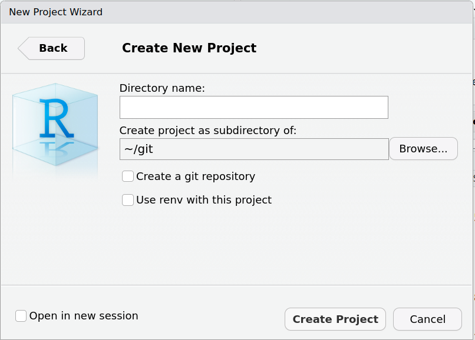
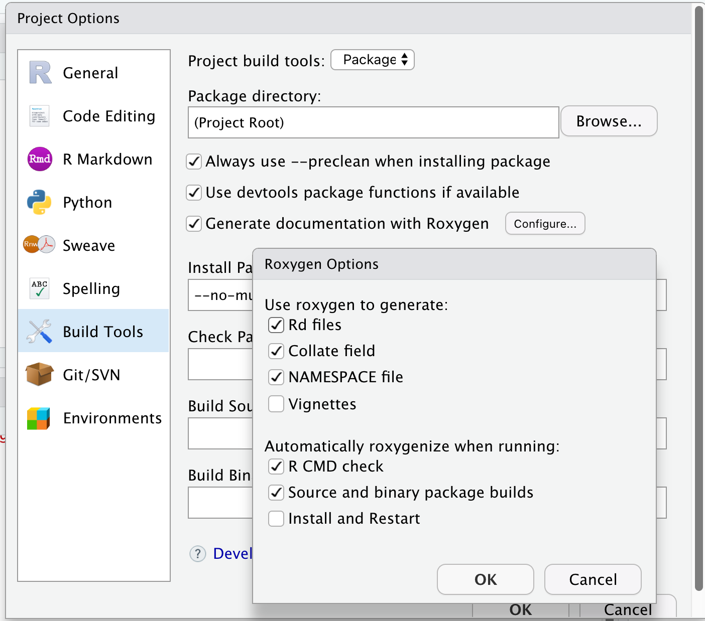

# Introduction

## What you know already

- Packages provide a mechanism for loading optional code, data, and documentation
- A library is a directory into which packages are installed
- `install.packages()` is used to install packages into the library
- `library()` is used to load and attach packages from the library
  - "Attach" means that the package is put in your `search` list --- objects in the package can be used directly
- Remember that **package $\neq$ library**

## What we want to talk about now

- How to write, build, test, and check your own package `r emoji::emoji("blush")`
- How to do this in a methodical and sustainable way
- Give tips and tricks based on practical experience

# Contents of a package

## How is a package structured?

Package source = directory with files and subdirectories

::: columns
::: {.column width="50%"}
- Mandatory:
  - DESCRIPTION
  - NAMESPACE
  - R
  - man
:::

::: {.column width="50%"}
- Typically also includes:
  - data
  - inst
  - src
  - tests
  - vignettes
  - NEWS
:::
:::

## How to get started quickly

Once upon a time, developers would set up this structure manually `r emoji::emoji("yawning_face")`

Nowadays, it's super fast with:

- `usethis::create_package()`
- RStudio > File > New Project > New Directory > R Package

{.r-stretch}

## `DESCRIPTION` file

- *Package*: Choose the name of your package
  - Not unimportant!
  - Check CRAN to see if your name is available
- *Title*: Add a Title for Your Package (Title Case)
- *Version*: Start with a low package version
  - `Major.Minor.Patch` syntax ([Semantic Versioning](https://semver.org/))
- *Authors@R*: Add authors and maintainer
- *Description*: Like an abstract, including references

## `DESCRIPTION` file (cont'd)

- *License*: Important for open sourcing
  - Consider permissive licenses such as Apache and MIT
- *Depends*:
  - Which R version users need to have at a minimum
  - Ideally don't put any package here
  - Packages will be loaded and attached upon `library` your package
- *Imports*: Packages which you import functions, methods, classes from
- *Suggests*: Packages for documentation processing (`roxygen2`), running
  examples, tests (`testthat`), vignettes

## `R` folder

- Only contains R code files (recommended to use `.R` suffix)
  - Can create a file with `usethis::use_r("filename")`
- Assigns R objects, i.e. mostly functions, but could also be constant
  variables, data sets, etc.
- Should not have any side effects, i.e. avoid `require()`, `options()` etc.
- If certain code needs to be sourced first, use on top of file (which will
  update the `Collate` field of `DESCRIPTION` automatically)

```{r}
#| echo: true
#| eval: false
#' @include dependency.R
NULL
```

## `NAMESPACE` file

```{r}
#| echo: true
#| eval: false

# Generated by roxygen2: do not edit by hand

export(package_used_first)
export(package_used_second)
export(package_used_third)
```

- Defines the namespace of the package, to work with R's namespace management system
- Namespace directives in this file allow to specify:
  - Which objects are exported to users and other packages
  - Which are imported from other packages

## `NAMESPACE` file (cont'd)

- Controls the search strategy for variables:
  1. Local (in the function body etc.)
  2. Package namespace
  3. Imports
  4. Base namespace
  5. Normal `search()` path

## `man` folder

- Contains documentation files for the objects in the package in the `.Rd` format
  - The syntax is a bit similar to `LaTeX`
- All user level objects should be documented
- Internal objects don't need to be documented --- but I recommend it!
- Once upon a time, developers would set up these `.Rd` files and the `NAMESPACE` manually `r emoji::emoji("yawning_face")`
- Fortunately, nowadays we have `roxygen2`! `r emoji::emoji("rocket")`

## `roxygen2` to the rescue!

- We can include the documentation source directly in the R script on top of the objects we are documenting
- Syntax is composed of special comments `#'` and special macros preceded with `@`
- In RStudio, running Build > More > Document will render the `.Rd` files and the `NAMESPACE` file for you
- Get started with `usethis::use_roxygen_md()`
- Placing your cursor inside a function in RStudio, create a `roxygen2` skeleton with Code > Insert Roxygen Skeleton

## Setting up `roxygen2` in your project

{.r-stretch}

## `roxygen2` source

`R/my_sum.R`:

```{r}
#| echo: true
#| eval: false
#' My Summation Function
#'
#' This is my first function and it sums two numbers.
#'
#' @param x first summand.
#' @param y second summand.
#'
#' @return The sum of `x` and `y`.
#' @export
#'
#' @note This function is a bit boring but that is ok.
#' @seealso [Arithmetic] for an easier way.
#'
#' @examples
#' my_sum(1, 2)
my_sum <- function(x, y) {
    x + y
}
```

## `roxygen2` output

`man/my_sum.Rd`:

```latex
% Generated by roxygen2: do not edit by hand
% Please edit documentation in R/my_sum.R
\name{my_sum}
\alias{my_sum}
\title{My Summation Function}
\usage{
my_sum(x, y)
}
\arguments{
\item{x}{first summand.}

\item{y}{second summand.}
}
\value{
The sum of \code{x} and \code{y}.
}
\description{
This is my first function and it sums two numbers.
}
\note{
This function is a bit boring but that is ok.
}
\examples{
my_sum(1, 2)
}
\seealso{
\link{Arithmetic} for an easier way.
}
```

## `roxygen2` output (cont'd)

`NAMESPACE`:

```r
# Generated by roxygen2: do not edit by hand

export(my_sum)
```

## `tests` folder

- Where store the unit tests covering the functionality of the package
- Get started with `usethis::use_testthat()` and `usethis::use_test()` and
  populate `tests/testthat` folder with unit tests
- Rarely, tests cannot be run within `testthat` framework, then these can go
  into R scripts directly in `tests` directory
- We will look at unit tests in detail later

## `data` folder

- For (example) data that you ship in your package to the user
  - Get started with `usethis::use_data()`
  - Note: Usually we use lazy data loading, therefore no `data()` call needed
    before using the data
- If you generate the example data, save the R script, too
  - Put that into `data-raw` folder, start with `usethis::use_data_raw()`

## `inst` folder

- Contents will be copied recursively to installation directory
  - Be careful not to interfere with standard folder names
- For data that is used by functions in the package itself
  - Those would typically go into `inst/extdata` folder
  - Load with `system.file("path/file", package = "mypackage")`
- `CITATION`: For custom `citation()` output
  - Create it with `usethis::use_citation()`
- `inst/doc` can contain documentation files (typically `pdf`)

## `src` folder

- Contains sources and headers for any code that needs compilation
- Should only contain a single language here
  - Because R uses it, mixing `C`, `C++` and `Fortran` usually works with OS
    native compilers
- Much more complex to write and maintain than an R only package
- Typically only makes sense for
  - Wrapping existing libraries for use in R
  - Speeding up complex or long computations

## `vignettes` folder

- Special case of documentation files (`pdf` or `html`) created by compiling
  source files
- Package users don't need to recompile the vignettes - they are delivered with
  the package
- Start a new vignette with `usethis::use_vignette()`
  - Starts an `Rmd` vignette, compiled with `knitr`
- Important for the user to understand the high-level ideas
- Complements function-level documentation from our `roxygen2` chunks

## `NEWS` file

- Lists user-visible changes worth mentioning
- In each new release, add items at the top under the version they refer to
- Don’t discard old items: leave them in the file after the newer items
- Start one with `usethis::use_news_md()`

# Licensing

## Licensing

- We mentioned before that licensing information is usually included in the `DESCRIPTION` file
- In fact, the `License` field (in standardized form) is mandatory
- Licensing for a package which might be distributed is an important but potentially complex subject
- It is very important to include licensing information, as otherwise:
  - It may not be possible to use it
  - It may not be possible to distribute copies of it
- We are going to talk more about licensing in Chapter 5 later today

## License options

- Common licenses for R packages: GPL-2, GPL-3, AGPL-3, MIT, ...

- Details and description of most licenses are available online:
  - <https://www.r-project.org/Licenses>
  - <https://choosealicense.com>
  - <https://cran.r-project.org/doc/manuals/R-exts.html#Licensing>

- Examples of standardized license specifications:

```
License: GPL-2
License: LGPL (>= 2.0, < 3) | Mozilla Public License
License: GPL-2 | file LICENCE
License: Artistic-2.0 | AGPL-3 + file LICENSE
```

- The optional file `LICENSE`/`LICENCE` contains a copy of the license
  - Only include such a file if it is referred to in the `License` field

## Adding a license to your package

- Once again, functions from the `usethis` package simplify this process:

  - `usethis::use_mit_license()`
  - `usethis::use_gpl_license()`
  - `usethis::use_agpl_license()`
  - `usethis::use_lgpl_license()`
  - `usethis::use_apache_license()`
  - `usethis::use_cc0_license()`
  - `usethis::use_ccby_license()`
  - `usethis::use_proprietary_license()`

# Building the package

## Documenting the package

- The first step is to produce the documentation files and `NAMESPACE`
- In RStudio: Build > More > Document
- In the console: `devtools::document()`

## Checking the package

- R comes with pre-defined check command for packages: "the R package checker" aka `R CMD check`
- About 22 checks are run (so quite a lot), including things like:
  - Can the package be installed?
  - Is the code syntax ok?
  - Is the documentation complete?
  - Do tests run successfully?
  - Do examples run successfully?
- In RStudio: Build > Check
- In the console: `devtools::check()`

## Building the package

- The R package folder can be compressed into a single package file
- Typically we manually only build "source" package
  - In RStudio: Build > More > Build Source Package
  - In the console: `devtools::build()`
- Makes it easy to share the package with others and submit to CRAN

## Installing the package

- R comes with pre-defined install command for packages: `R CMD INSTALL`
- In RStudio: Build > Install
- In the console: `devtools::install()`
- Note: During development it's usually sufficient to use Build > More > Load All
  - Runs `devtools::load_all()`
  - Roughly simulates what happens when package would be installed and loaded
  - **Unexported** objects and helpers under `tests` will also be available
  - Key: much faster!

## Keyboard shortcuts

- Learning some of the RStudio keyboard shortcuts can speed up many of the tasks we introduced in this lecture:

```{r}
#| echo: false

readr::read_csv(here::here("slides/resources/keyboard-shortcuts.csv"), col_types = "ccc") |>
  knitr::kable(align = "ccc")
```

- There are many more – check for instance the [RStudio IDE Documentation](https://docs.posit.co/ide/user/ide/reference/shortcuts.html)

# Exercise

## Let's try this out now `r emoji::emoji("blush")`

1. Set up a new R package with a fancy name
1. Fill out the `DESCRIPTION` file
1. Include a few functions
1. Add `roxygen2` documentation
1. Pick and add a license to the package
1. Export the function to the namespace
1. Produce the package documentation
1. Run checks
1. Build the package

$\leadsto$ We will be using this package throughout the day!

# References

- [R Packages (2e)](https://r-pkgs.org/)
- [Writing R Extensions](https://cran.r-project.org/doc/manuals/R-exts.html)
- [Super technical details about R Markdown](https://www.youtube.com/watch?v=fiy32LjgGUE)

# License information {.smaller}

- Creators (initial authors):
  Daniel Sabanés Bové [`r fontawesome::fa("github")`](https://github.com/danielinteractive/) [`r fontawesome::fa("linkedin")`](https://www.linkedin.com/in/danielsabanesbove/),
  Liming Li [`r fontawesome::fa("github")`](https://github.com/clarkliming),
  Philippe Boileau [`r fontawesome::fa("globe")`](https://pboileau.ca/),
  Alessandro Gasparini [`r fontawesome::fa("linkedin")`](https://www.linkedin.com/in/ellessenne) [`r fontawesome::fa("github")`](https://www.github.com/ellessenne) [`r fontawesome::fa("globe")`](https://www.ellessenne.xyz/)


