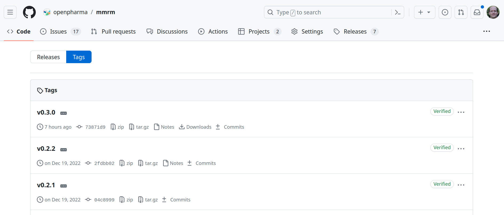
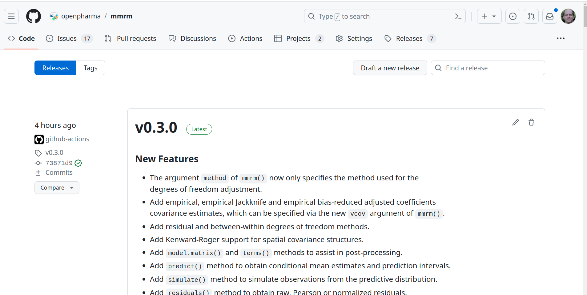

```{r, echo = FALSE, results = 'hide'}
# Workaround for the following Quarto issue (do not remove):
# Quarto will not render embedded R code unless at least one R code chunk exists
```

# Website with `pkgdown`

## Setup of `pkgdown`

- `pkgdown` makes it quick and easy to build a website for your package
- After installing `pkgdown`, run `usethis::use_pkgdown()` to get started
- Alternatively, run `usethis::use_pkgdown_github_pages()`
  - Adds (and writes) `pkgdown.yml`, `docs` folder, and "pkgdown" to `.Rbuildignore` and `docs` to `gitignore`. Also initialises empty branch `gh-pages` in chosen repo and activates GitHub Pages for repo
- Main configuration happens in `_pkgdown.yml` file
- Many customizations can be applied, but bulk of work during development is
  updating the `reference` section with names of `.Rd` files

## Example `_pkgdown.yml` File

```{r}
#| output: asis
#| echo: false
file <- readLines(con = "https://raw.githubusercontent.com/openpharma/mmrm/refs/heads/main/_pkgdown.yml")
cat("```yaml \n---\n")
writeLines(file[-1])
cat("\n---\n```")
```

Source: the [`mmrm`](https://github.com/openpharma/mmrm/blob/main/_pkgdown.yml) package documentation

##  {background-iframe="https://openpharma.github.io/mmrm/latest-tag/reference/index.html" background-interactive="true"}

## Publication as GitHub page

- It's helpful for users to read the website online
- GitHub is very helpful here because:
  - A separate branch, `gh-pages`, stores the rendered website
  - GitHub actions automatically render the website when the `main` branch is updated
- To get started, use `usethis::use_pkgdown_github_pages()`
  - Or, manually deploy site with `pkgdown::deploy_to_branch()`

##  {background-iframe="https://openpharma.github.io/mmrm/latest-tag/" background-interactive="true"}

# Licensing, open sourcing, versioning

## Licensing

- High level categorization of licenses:
  - "Permissive": Relaxed. Can be freely copied, modified, published (under the same license).
  - "Copyleft": Stricter. Same rights need to be preserved in derivative works.
  - Helpful tool: <https://choosealicense.com/>
- R itself is licensed under GPL, but packages can choose, e.g.:
    - `usethis::use_mit_license()` for permissive MIT
    - `usethis::use_gpl_license()` for copyleft GPL
- Include minimum version, e.g. `GPL (>= 3)`

## Licensing (cont'd)

- Need to be careful here when you bundle any code from other software
  - Care must be taken that any copyright/license statements from copied or modified code are preserved and authorship is not misrepresented
- Are the licenses of your package and the source compatible?
  - e.g. cannot copy/paste code from a GPL package and publish in an MIT package
- `LICENSE` file optionally can contain further restrictions of the license

## Licensing (cont'd)

- You don't have to include a license with your code
- But: if no license is included, your work is under your exclusive copyright by default
  - This means that nobody else can copy, distribute, modify it
  - Once the work has other contributors (each being a copyright holder for their contributions), that _nobody_ starts including you
  - The consequence is that you cannot copy, distribute, modify other people's contributions to your project
- Even if unlicensed code is published in a public repository, as a user, you generally don't have the permission from the creators of the software to use, modify, or share the software

## Open sourcing

- The easiest way to "open source" your R package is to make the GitHub/code repository public
- This allows for easy open source contributions from other developers via pull requests
- Please check with your organization first:
  - Are they ok to publish the software?
  - What is the appropriate copyright holder?
- Also allows bugs to be filed and to have the GitHub issues page in the package description

## Versioning

- The `Version` field defines the package version
- Syntax: Three integers separated by `.` or `-`
  - Canonical form is: `x.y-z`, equivalent to `x.y.z`
- Useful conventions of "semantic versioning":
  - `x` is major: Increment this for breaking changes
  - `y` is minor: Increment this for new features
  - `z` is patch: Increment this for bug fixes only
  - `x.y.z.9000` and count up during development
  - `usethis::use_version()` can help with this

<!-- Keep in mind to update the `NEWS` file for any user-visible change -->

# Checks before release

## CRAN (The Comprehensive R Archive Network)

- CRAN is the central repository for R packages
- It has additional requirements beyond the standard package ones, which are described in the Repository Policy
- Submitting a package indicates agreement with the policy
- In particular: "The time of the volunteers is CRAN’s most precious resource, and they reserve the right to remove or modify packages on CRAN without notice or explanation (although notification will usually be given)."

## CRAN (cont'd)

- Only source packages can be submitted
<!-- no binary executables are allowed -->
  - But `.rda` data files are allowed
- Need single designated maintainer (person, not mailing list)
  - Additional `Contact` field could be used
- Citations in author-year style, followed by `<doi:...>`
- Reducing run time of tests, checks, examples, vignettes is important
- Need to provide cross-platform portable code:
  CRAN runs checks on Windows, Mac, and several Linux distributions

## CRAN (cont'd)

`r emoji::emoji("exclamation")` A CRAN submission can be punishing, painful, and nerve-racking:

The first release of the [rpact](https://cran.r-project.org/package=rpact) package took 5 weeks and 6 submission attempts.
Painful experiences:

-   Some Linux machines may generate different random numbers than expected (despite setting a seed)
-   Not only errors and warnings lead to the rejection of a submitted package, but also notes
-   Your local Windows test system may be much faster than the CRAN system (e.g., 5 times)
-   Don't use "R Package for" in your package title
-   The description of the package must be provided with a DOI reference

## CRAN (cont'd) {.scrollable}

Example message informing about the rejection of the last [rpact](https://cran.r-project.org/package=rpact) submission:

> Dear maintainer,
>
> package rpact_3.3.2.tar.gz does not pass the incoming checks automatically,
> please see the following pre-tests: \
> Windows:
> [00check.log](https://cran.r-project.org/web/checks/check_results_rpact.html)
> **Status: OK**, Debian:
> [00check.log](https://cran.r-project.org/web/checks/check_results_rpact.html)
> **Status: OK**
>
> Please fix all problems and resubmit a fixed version via the webform.
>
> Best regards, \
> CRAN teams' auto-check service
>
> r-devel-windows-x86_64 Check: Result: NA, Maintainer: 'Friedrich Pahlke'\
> r-devel-windows-x86_64 Check: Overall checktime, Result: NOTE, Overall
> checktime 12 min \> 10 min\
> r-devel-linux-x86_64-debian-gcc Check: Result: Note_to_CRAN_maintainers
> Maintainer: 'Friedrich Pahlke'

## R-Hub to the rescue

::: columns
::: {.column width="30%"}

:::

::: {.column width="70%"}
- Free `R CMD check` runs on [different operating systems](https://r-hub.github.io/rhub/reference/rhub_platforms.html) before submitting to CRAN
- Supported by the R consortium
- New v2 API relies on GitHub actions for checks
- [Blog post](https://blog.r-hub.io/2024/04/11/rhub2/) announcing the transition to the new API: <https://blog.r-hub.io/2024/04/11/rhub2/>
:::
:::

## R-Hub platforms

```{r}
#| echo: true
library(rhub)
rhub::rhub_platforms()
```

## GitHub actions

- It is also possible to use [GitHub Actions](https://docs.github.com/en/actions) to run `R CMD check`
- Free for public repositories, paid service for private repositories
- Checks will be run every time someone pushes a commit to a repository hosted on GitHub
- Easy setup from your R console: `usethis::use_github_action_check_standard()`
  - This runs a standard `R CMD check ` on three major operating systems
- Script and documentation are developed and maintained by the `r-lib` organization [here](https://github.com/r-lib/actions/tree/v2/check-r-package)

# GitHub

## Tags

- Tags are a feature of Git, i.e., not specific to GitHub
- Git can tag (or "bookmark") specific points in the code history as being important
- Typically, for each release, create a tag `vx.y.z` (MAJOR.Minor.patch format)
- The value here is that users can later check out the package in the state of this release version
  - Download in R: `remotes::install_github("org/package", ref = "vx.y.z")`
  - Comparison of versions are also possible, etc.

## Tags: example



## Releases

- [Releases](https://docs.github.com/en/repositories/releasing-projects-on-github/about-releases) are based on Git tags, and a feature of GitHub
- Are "deployable software packages to make them available for a wider audience to download and use"
- Contain release notes and links to the binary package files for download
  - However, for R packages these `tar.gz` package files are rarely used directly

```{bash}
#| eval: false
git diff v0.3.14 v0.3.15 # checking for difference in mmrm release
```

## Releases: example



# Bioconductor

## A Note on Bioconductor

- The [Bioconductor](https://www.bioconductor.org/) project develops, supports, and disseminates open source software for the analysis of biological assays
- Like CRAN, Bioconductor has additional package requirements: one can only submit either to CRAN or Bioconductor
- Packages are peer reviewed by community members
- New packages and updates to existing packages are released semi-annually
- Software is expected to be interoperable with other Bioconductor packages through the re-use of common data structures and infrastructure

# References

- [Licensing chapter](https://r-pkgs.org/license.html)
- [All possible licenses for CRAN packages](https://svn.r-project.org/R/trunk/share/licenses/license.db)
- [Compare and pick licenses](https://choosealicense.com/)
- [GitHub releases](https://docs.github.com/en/repositories/releasing-projects-on-github/about-releases)
- [CRAN Repository Policy](https://cran.r-project.org/web/packages/policies.html)
- [Bioconductor packages](https://contributions.bioconductor.org/index.html)

# Exercise{.smaller}

Use your project from *chapter 2* :

- Run CRAN-like checks in RStudio:
  - Go to Tools -> Project Options -> Build Tools -> "Check package - R CMD check additional options"
  - Type `--as-cran`

- Alternatively, use `--as-cran` in argument in console:

```{r}
#| eval: false
rcmdcheck::rcmdcheck("myrootdir", args = "--as-cran")
```

- Look at the CI/CD checks reported on your GitHub repository
  - Where are the `R CMD check` results?
- Enable GitHub page through [`use_pkgdown_github_pages()`](https://pkgdown.r-lib.org/articles/pkgdown.html) 
  - Note: This includes `use_pkgdown()`, `use_github_pages()`, `use_github_action("pkgdown")`
- Deploy the website with `pkgdown`
- Set up a GitHub action to deploy website `use_github_action("pkgdown")`
  - (Optional) Check the automatic GitHub page deploy action

# License information {.smaller}

- Creators (initial authors):
  Daniel Sabanés Bové [`r fontawesome::fa("github")`](https://github.com/danielinteractive/) [`r fontawesome::fa("linkedin")`](https://www.linkedin.com/in/danielsabanesbove/),
  Friedrich Pahlke [`r fontawesome::fa("github")`](https://github.com/fpahlke/) [`r fontawesome::fa("linkedin")`](https://www.linkedin.com/in/pahlke/),
  Liming Li [`r fontawesome::fa("github")`](https://github.com/clarkliming),
  Philippe Boileau [`r fontawesome::fa("globe")`](https://pboileau.ca/),
  Alessandro Gasparini [`r fontawesome::fa("linkedin")`](https://www.linkedin.com/in/ellessenne) [`r fontawesome::fa("github")`](https://www.github.com/ellessenne) [`r fontawesome::fa("globe")`](https://www.ellessenne.xyz/),
  Audrey Yeo Te-ying [`r fontawesome::fa("linkedin")`](https://www.linkedin.com/in/audreyyeo8000/) [`r fontawesome::fa("github")`](https://github.com/audreyyeocH)


